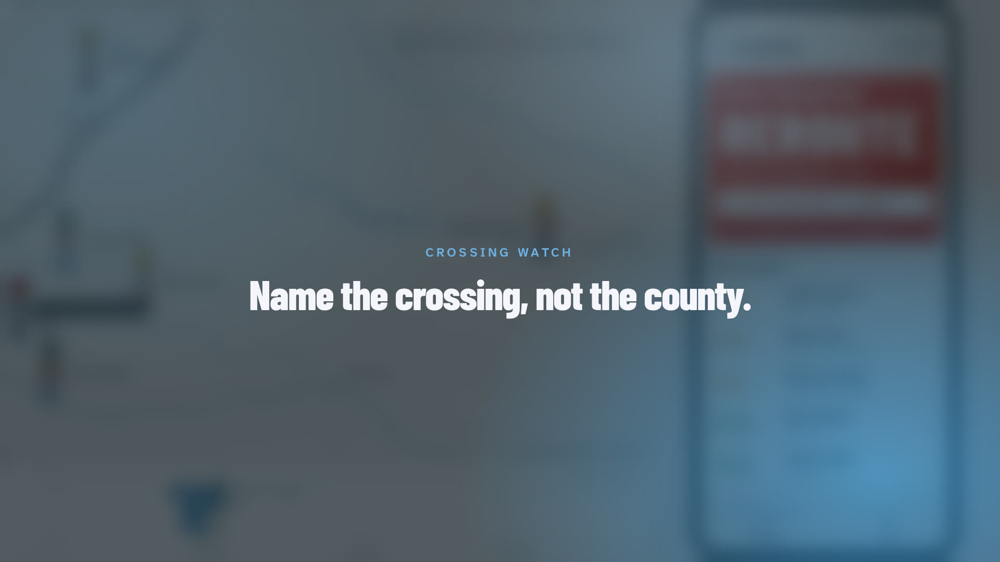
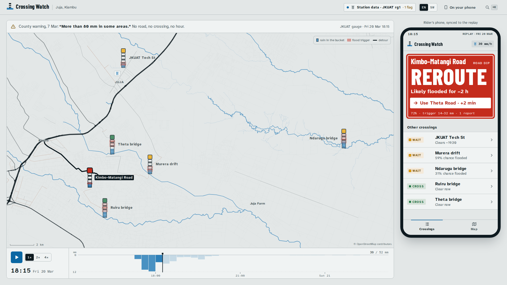
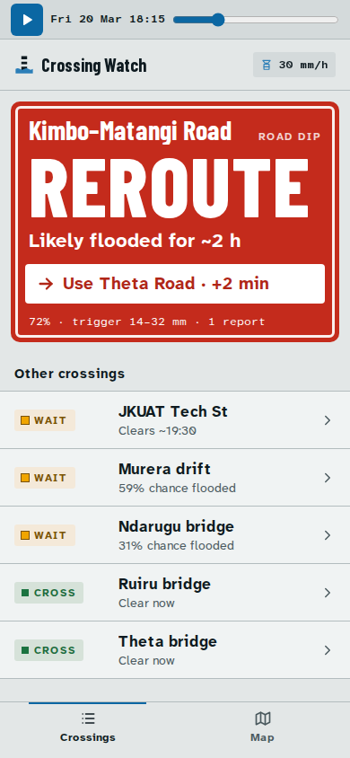
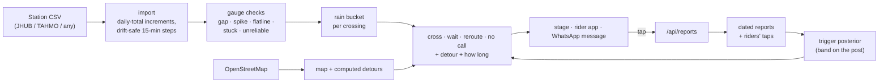

# Crossing Watch

**Know which crossing is flooded before you ride into it.** When a storm starts in Juja, boda riders, commuters and JKUAT students get a county-wide warning: "more than 80 mm in some areas". Crossing Watch gives a call for each named crossing instead: **cross**, **wait** or **reroute**, and for how long.

**Live:** [crossing-watch.vercel.app](https://crossing-watch.vercel.app) · the demo screen: [/replay](https://crossing-watch.vercel.app/replay) · the rider app: [/app](https://crossing-watch.vercel.app/app)

**Demo video (2:23):** [docs/demo/crossing-watch-demo.mp4](docs/demo/crossing-watch-demo.mp4)

[](docs/demo/crossing-watch-demo.mp4)



| Rider app (`/app`) | What a rider sends to the stage WhatsApp group |
|---|---|
|  | ```Kimbo–Matangi Road: likely FLOODED until about 20:15.```<br>```Use Theta Road · +2 min.```<br>```Rain at JKUAT gauge 1: 30 mm in the last 3 h (18:15, Fri 20 Mar).``` |

## The problem, with receipts

- Kimbo–Matangi Road flooded on 9 Mar and again on 28 Apr 2026; pedestrians had to walk through stagnant water ([The Star](https://www.the-star.co.ke/news/2026-04-28-photos-kimbo-matangi-road-flooded-movement-disrupted)).
- The Ndarugu bridge between Juja Farm and Komo collapsed after heavy rain on 3 Nov 2023 ([Kenya Times](https://thekenyatimes.com/latest-kenya-times-news/traffic-alert-floods-disrupt-transport-along-thika-juja-road/)).
- Kenya Met's 7 Mar 2026 warning said "more than 80 mm in some areas, including Thika, Juja, Ruiru" ([Kenyans.co.ke](https://www.kenyans.co.ke/news/121468-kenya-met-warns-flooding-nairobi-kiambu-and-kajiado-rains-100mm)). It named no road and no hour.
- Kenya Met expects wetter-than-normal October–December rain in Kiambu, starting in the second and third weeks of October ([The Star](https://www.the-star.co.ke/news/2026-08-27-brace-for-wetter-than-normal-october-dec-rains)).

Existing tools don't make a call for a named crossing:

- FlowSafe uses the same JKUAT gauge but scores flood risk per farm.
- Google Flood Hub works on 20×20 km cells.
- mafuriko maps fixed Nairobi hotspots.

## How it works

1. **One gauge, every 15 minutes.** This is the JHUB Conduit station at JKUAT, 6–24 Mar 2026.
2. **Every crossing has a bucket.** Rain fills it; it drains by half every *h* hours. A campus culvert empties in 45 minutes and the Ndarugu river bridge in 10 hours: same rain, different signatures.
3. **Reports set the trigger.** The trigger is the bucket level at which the crossing goes under. It is a probability distribution, updated from dated reports:
   - A "clear" report at 19 mm says the trigger is above 19; a "flooded" one at 36 mm says it's below.
   - The red band on each depth post is where the trigger most likely sits. **Every rider's tap tightens it.**
4. **The call:**
   - **NO CALL** if the gauge is silent.
   - **REROUTE** if the crossing is likely flooded and waiting would take longer than a clear detour. **WAIT** if it's flooded but clears soon, or it's uncertain.
   - **CROSS** if it's likely clear.
   - Safety rules sit on top: a fresh "flooded" report forces at least WAIT, a "clear" report never forces CROSS, and a silent gauge never gives CROSS.

The call is plain, tested code, with no language model ([ADR 001](docs/adr/001-deterministic-calls.md)). The model runs in the browser in well under 50 ms per tap.



## Evidence

| Claim | Proof |
|---|---|
| Works on the real station data | `npm run verify`: on the 20 Mar storm, Kimbo–Matangi goes REROUTE via Theta Road at 18:00 saying it clears in ~2½ h; the call eases to WAIT at 20:30 and is back to CROSS at 21:15. |
| Each crossing has its own signature | Same run: the JKUAT culvert clears at 20:15, Kimbo–Matangi at 21:15, the Ndarugu river at 01:30. |
| Every tap sharpens it | Same run: one "flooded" tap at Ndarugu narrows its trigger from 28–88 mm to 25–57 mm (45% narrower) and flips WAIT → REROUTE. |
| Handles broken gauges | The station's `rg1` column under-reports about 17×, so rain is read from its running daily total. Gauge 2's total goes backwards 375 times (it tracks daylight), so it's ignored. See the Data health tab and [ADR 004](docs/adr/004-station-data-and-fallback.md). |
| Never unsafe on bad data | Unit tests (`npm test`): silent gauge → NO CALL, never CROSS; fresh flood report → at least WAIT; no flicker. |
| Designed, not templated | [DESIGN.md](DESIGN.md) (lint-clean design system), every component state at `/_kit`. |

## What's real and what's simulated

| | Status |
|---|---|
| Rain series | **Real**: JHUB Conduit station at JKUAT, 6–24 Mar 2026 (public API), in `data/fixtures/`. A **simulated** fallback series (clearly labelled) runs when no station file is present. |
| Flood report that sets Kimbo–Matangi's trigger | **Real**: The Star, 9 Mar 2026, used as "flooded at some point" between the storm and publication. |
| Other crossings' triggers | **Estimates** by crossing type until someone reports; wide dashed bands say so. |
| Crossing locations, map, detours | **Real OpenStreetMap geometry**. The exact flooded spot on Kimbo–Matangi is approximate. Detours are shortest paths on OSM roads at boda speed (≈25 km/h). |
| "Theta Road" | Name from local knowledge; OSM has no road by that name. |

## Run it

```bash
npm install
npm run dev              # http://localhost:3000  (use: npx next dev -p 3100 if 3000 is busy)
npm run verify           # the demo scenario, headless, PASS/FAIL
```

| Route | What it is |
|---|---|
| `/` | Landing page: the headline, the live rider app looping the storm, every crossing's calls on the real 20 March storm, how it works, and what is and isn't known. |
| `/replay` | The demo screen: the county warning line, the map and the replay strip, with the rider's phone synced beside it. Autoplays; the first red call lands within 10 s. |
| `/app` | Rider app. Opens at the first red call. `?follow=1` follows the stage's replay (QR code in the top bar). |
| `/how` | How a trigger is learned, with an interactive depth post. |
| `/_kit` | Every component state. `?state=cross\|wait\|reroute\|nocall\|loading\|error` |
| `/replay?data=simulated` | The simulated fallback series. |

**Replay keys:**

| Key | Action |
|---|---|
| Space | Play / pause |
| ← / → | Step 15 min (hold Shift for 1 h) |
| 1 / 2 / 4 | Speed |
| J | Jump to the storm |
| L | English / Kiswahili |
| ⌘K | Commands |
| 0 or ⇧⌘R | Reset the demo |

**Real data:** drop any station CSV on the stage, or run `npm run data:ingest -- path/to/file.csv` to make it the default. Formats accepted:

- JHUB Conduit (`rg1tt` daily totals)
- TAHMO (`time, station_id, precip_mm, precip_quality_flag`)
- any file with a time column and a rain column

To go back to the simulated series: `npm run data:ingest -- --clear`.

Other scripts: `npm test`, `npm run lint`, `npm run typecheck`, `npm run data:geo` (rebuild map and detours from OSM), `npm run data:demo` (regenerate the simulated series).

## Limitations

- Triggers start from a single storm and a single dated news report. They become trustworthy only as riders report. The bands show this honestly.
- One gauge serves every crossing; the Ndarugu bridge is 13 km from it.
- No user survey yet: the next step is a pilot with three boda stages and JKUAT before the October rains.
- The Swahili copy needs review by a native speaker.
- On serverless hosting the report store is per instance (fine for one presenter; swap in a key-value store for a pilot, [ADR 003](docs/adr/003-client-side-model.md)).

## Credits

Map data © OpenStreetMap contributors (ODbL). Rain data: JHUB Africa Conduit station, JKUAT. News sources are linked above and on `/how`. Built with Claude Code. Design system in [DESIGN.md](DESIGN.md); architecture decisions in [docs/adr](docs/adr).
